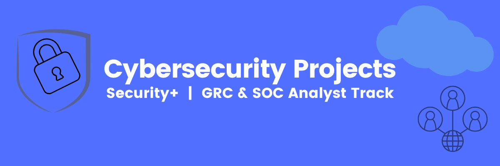

# Cybersecurity Capstone Cohort Projects (Weeks 1–8)
**Diversity Cyber Council | Security+ Track | 2025**

This repository showcases hands-on projects completed during my Cybersecurity Capstone program. These projects emphasize **Governance, Risk & Compliance (GRC)**, **SOC Analyst fundamentals**, **SIEM tools**, **Linux administration**, and **network security concepts**, preparing me for roles in **IT Risk Management**, **Compliance Analysis**, and **Cybersecurity Operations**.

---

## 🧠 **Skills Demonstrated**
- Risk Assessment & GRC Fundamentals (ISO, NIST)
- SIEM & SOAR Operations (Microsoft Sentinel)
- Threat Detection & Incident Reporting
- Security Awareness & Social Engineering Defense
- Linux Administration & Permissions Management
- Network Configuration & IP Addressing (Packet Tracer)
- Traffic Analysis using Wireshark
- Business Case Development for Cybersecurity Strategy

---

## 📂 Project Overview

| Week | Project Title & Details |
|------|--------------------------|
| [1](Week1_Cybersecurity_Pathways_AI) | [Cybersecurity Career Pathways + AI](Week1_Cybersecurity_Pathways_AI) Core Skills: Role Mapping, GRC Awareness |
| [2](Week2_Azure_Sentinel_SIEM_SOAR) | [Azure Sentinel SIEM & SOAR Lab](Week2_Azure_Sentinel_SIEM_SOAR) Core Skills: SIEM Setup, Threat Detection |
| [3](Week3_Phishing_Awareness) | [Phishing Awareness Builder](Week3_Phishing_Awareness) Core Skills: Social Engineering Defense |
| [4](Week4_Linux_Virtualization_Lab) | [Virtualization & Linux Fundamentals](Week4_Linux_Virtualization_Lab) Core Skills: CLI, File Permissions |
| [5](Week5_CRM_Simulation_GRC) | [CRM Simulation for Governance](Week5_CRM_Simulation_GRC) Core Skills: Data Lifecycle, GRC Processes |
| [6](Week6_Small_Office_Network_PacketTracer) | [Small Office Network Build (Packet Tracer)](Week6_Small_Office_Network_PacketTracer) Core Skills: IP Addressing, NAT |
| [7](Week7_Wireshark_Traffic_Analysis) | [Wireshark Traffic Analysis](Week7_Wireshark_Traffic_Analysis) Core Skills: Packet Capture, Protocol Analysis |
| [8](Week8_Interview_Business_Case) | [Interview Business Case Presentation](Week8_Interview_Business_Case) Core Skills: Risk Strategy, Executive Reporting |

---

### ✅ **How to Navigate**
- Each folder (`WeekX_ProjectName`) contains:
    - `README.md` with project summary, objectives, tools, and screenshots
    - Supporting files (e.g., diagrams, config files, slides)

---

## 📚 What I Learned Each Week (Capstone Security+ Cohort)

### ✅ Week 1 – Cybersecurity Foundations & Risk Management
- Gained an understanding of cybersecurity principles aligned with the **CIA Triad (Confidentiality, Integrity, Availability)**.
- Learned about risk assessment methodologies, compliance standards (**NIST**, **ISO 27001**), and their importance in **GRC roles**.
- Explored security frameworks and controls that form the foundation for enterprise security programs.

---

### ✅ Week 2 – Networking & Security Fundamentals
- Built knowledge of **TCP/IP**, subnetting, VLANs, and NAT.
- Understood how **firewalls, routers, and switches** enforce network segmentation and protect against threats.
- Learned basic troubleshooting and configuration for secure network environments.

---

### ✅ Week 3 – Security Tools & Threat Analysis
- Gained hands-on experience using **SIEM concepts** and understanding event logging for detection of anomalies.
- Learned how to analyze threat intelligence reports and identify common attack vectors (phishing, malware, insider threats).
- Practiced applying risk management concepts to mitigate vulnerabilities.

---

### ✅ Week 4 – Linux Virtualization & Command Line Lab
- Installed and configured **Ubuntu Linux in VirtualBox** to simulate enterprise environments.
- Practiced **file permissions (`chmod`, `chown`)** and user management for OS-level security.
- Learned how **Linux logs and configurations** support compliance and system hardening.

---

### ✅ Week 5 – Incident Response & Forensics Basics
- Gained exposure to **Incident Response (IR) frameworks** like NIST 800-61.
- Learned the phases of IR: **Preparation, Detection, Containment, Eradication, Recovery, Lessons Learned**.
- Practiced basic forensic evidence handling and the importance of **chain of custody**.

---

### ✅ Week 6 – Small Office Network Build
- Designed and simulated a **LAN environment** using Cisco Packet Tracer.
- Configured IP addressing, NAT, and basic router/switch security.
- Understood how network topology impacts performance, scalability, and security compliance.

---

### ✅ Week 7 – Security Policies & Compliance
- Developed and reviewed **security policies** related to access control, incident response, and password management.
- Learned the role of **IT General Controls (ITGC)** in governance and regulatory compliance (SOX, HIPAA).
- Understood how policies align with organizational risk management strategies.

---

### ✅ Week 8 – Capstone Project & Presentation
- Consolidated hands-on labs into a **comprehensive security program overview**.
- Practiced presenting technical concepts to non-technical stakeholders for business impact.
- Demonstrated proficiency across **GRC, SOC fundamentals, and Security+ domains** in a real-world scenario.
